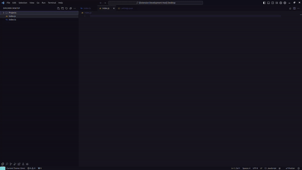

# Theme Switch Extension

🇧🇷 **PT:** A extensão Theme Switch Code permite alternar automaticamente o tema de cor com base na extensão do arquivo que você está editando.

🇺🇸 **EN:** The Theme Switch extension allows you to automatically switch the color theme based on the file extension you are editing.



## File Association

```json
{
  "switchtheme.files.association": {
    "js": "Dracula",
    "ts": "Omni",
    "html": "Solarized Light",
    "css": "Monokai"
  }
}
```

Made with 💙 by [@vitor3g](https://github.com/vitor3g)
